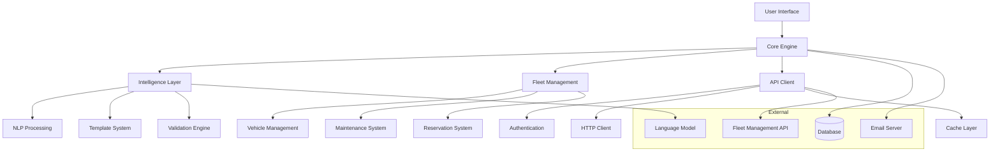

# ComBadge Developer Guide

Complete development guide for contributing to and extending ComBadge.

## Table of Contents

1. [Development Setup](#development-setup)
2. [Architecture Overview](#architecture-overview)
3. [Core Components](#core-components)
4. [Development Workflow](#development-workflow)
5. [Testing Guidelines](#testing-guidelines)
6. [API Reference](#api-reference)
7. [Extension Points](#extension-points)
8. [Contributing Guidelines](#contributing-guidelines)

## Development Setup

### Prerequisites

**System Requirements:**
- Python 3.9+ (3.11 recommended)
- Git 2.30+
- Docker 20.10+ (for testing)
- PostgreSQL 13+ (for integration tests)

**Development Tools:**
- IDE: VS Code, PyCharm, or similar
- Code formatter: Ruff
- Type checker: MyPy
- Testing: Pytest
- Documentation: Sphinx

### Quick Setup

```bash
# Clone the repository
git clone https://github.com/company/combadge.git
cd combadge

# Set up development environment
python -m venv venv
source venv/bin/activate  # On Windows: venv\Scripts\activate

# Install development dependencies
pip install -e ".[dev]"
pip install -r requirements-dev.txt

# Set up pre-commit hooks
pre-commit install

# Run tests to verify setup
make test-fast
```

### Environment Configuration

Create development configuration:

```bash
# Copy environment template
cp config/.env.example .env.dev

# Edit development settings
cat > .env.dev << EOF
COMBADGE_ENV=development
COMBADGE_DEBUG_MODE=true
COMBADGE_DATABASE_URL=sqlite:///./dev_data/combadge.db
COMBADGE_LLM_BASE_URL=http://localhost:11434
COMBADGE_LLM_MODEL=qwen2.5:7b
COMBADGE_SECRET_KEY=dev-secret-key-change-in-production
EOF

# Create development database
mkdir -p dev_data
python -m combadge.db.init --config=development
```

### IDE Configuration

**VS Code Settings (`.vscode/settings.json`):**

```json
{
    "python.defaultInterpreterPath": "./venv/bin/python",
    "python.linting.enabled": true,
    "python.linting.ruffEnabled": true,
    "python.formatting.provider": "ruff",
    "python.testing.pytestEnabled": true,
    "python.testing.pytestArgs": ["tests/"],
    "files.exclude": {
        "**/__pycache__": true,
        "**/*.pyc": true,
        ".pytest_cache": true,
        ".mypy_cache": true,
        ".ruff_cache": true
    },
    "[python]": {
        "editor.formatOnSave": true,
        "editor.codeActionsOnSave": {
            "source.organizeImports": true
        }
    }
}
```

## Architecture Overview

### High-Level Architecture



### Module Structure

```
src/combadge/
├── core/                  # Core application logic
│   ├── config_manager.py  # Configuration management
│   ├── database.py        # Database abstraction
│   └── exceptions.py      # Custom exceptions
├── intelligence/          # AI and NLP components
│   ├── nlp_processor.py   # Natural language processing
│   ├── intent_classifier.py # Intent classification
│   └── entity_extractor.py # Entity extraction
├── fleet/                 # Fleet management logic
│   ├── templates/         # Template system
│   ├── vehicles.py        # Vehicle management
│   ├── maintenance.py     # Maintenance system
│   └── reservations.py    # Reservation system
├── api/                   # External API integration
│   ├── client.py          # HTTP client
│   ├── authentication.py  # Auth handlers
│   └── cache.py           # Cache layer
├── ui/                    # User interface
│   ├── components/        # UI components
│   └── workflows/         # UI workflows
└── utils/                 # Utility functions
    ├── logging.py         # Logging utilities
    └── validation.py      # Validation helpers
```

## Core Components

### 1. Intelligence Layer

**Natural Language Processing Engine:**

```python
# src/combadge/intelligence/nlp_processor.py
from typing import Dict, Any, List, Optional
from dataclasses import dataclass

@dataclass
class NLPResult:
    """Result of natural language processing."""
    intent: str
    confidence: float
    entities: Dict[str, Any]
    reasoning: List[str]
    
class NLPProcessor:
    """Main natural language processing engine."""
    
    def __init__(self, llm_client, intent_classifier, entity_extractor):
        self.llm_client = llm_client
        self.intent_classifier = intent_classifier
        self.entity_extractor = entity_extractor
        
    async def process_request(
        self, 
        text: str, 
        context: Optional[Dict[str, Any]] = None
    ) -> NLPResult:
        """
        Process natural language request.
        
        Args:
            text: User's natural language request
            context: Optional conversation context
            
        Returns:
            NLPResult with intent, entities, and reasoning
        """
        # Classify intent
        intent_result = await self.intent_classifier.classify(text, context)
        
        # Extract entities
        entities = await self.entity_extractor.extract(text, intent_result.intent)
        
        # Generate reasoning
        reasoning = await self._generate_reasoning(text, intent_result, entities)
        
        return NLPResult(
            intent=intent_result.intent,
            confidence=intent_result.confidence,
            entities=entities,
            reasoning=reasoning
        )
```

**Template System:**

```python
# src/combadge/fleet/templates/json_generator.py
from typing import Dict, Any, Optional
import json

class JSONGenerator:
    """Generates API requests from templates and extracted entities."""
    
    def __init__(self, template_manager, validator):
        self.template_manager = template_manager
        self.validator = validator
        
    def generate_json(
        self,
        template_name: str,
        entities: Dict[str, Any],
        intent: str,
        confidence: float
    ) -> Dict[str, Any]:
        """
        Generate JSON API request from template and entities.
        
        Args:
            template_name: Name of template to use
            entities: Extracted entities from NLP
            intent: Classified intent
            confidence: Confidence score
            
        Returns:
            Generated JSON for API request
        """
        template = self.template_manager.get_template(template_name)
        
        # Populate template with entities
        json_request = self._populate_template(template, entities)
        
        # Validate generated request
        validation_result = self.validator.validate_request(
            json_request, template
        )
        
        if not validation_result.is_valid:
            raise ValueError(f"Invalid request: {validation_result.errors}")
            
        return json_request
```

### 2. API Integration Layer

**HTTP Client with Circuit Breaker:**

```python
# src/combadge/api/client.py
import asyncio
from typing import Dict, Any, Optional
from dataclasses import dataclass, field
from datetime import datetime, timedelta

@dataclass
class CircuitBreakerState:
    """Circuit breaker state tracking."""
    failure_count: int = 0
    last_failure_time: Optional[datetime] = None
    state: str = "closed"  # closed, open, half-open
    
class HTTPClient:
    """HTTP client with circuit breaker and retry logic."""
    
    def __init__(
        self,
        base_url: str,
        timeout: int = 30,
        max_retries: int = 3,
        circuit_breaker_threshold: int = 5
    ):
        self.base_url = base_url.rstrip('/')
        self.timeout = timeout
        self.max_retries = max_retries
        self.circuit_breaker_threshold = circuit_breaker_threshold
        self.circuit_breaker = CircuitBreakerState()
        
    async def request(
        self,
        method: str,
        endpoint: str,
        data: Optional[Dict[str, Any]] = None,
        headers: Optional[Dict[str, str]] = None
    ) -> Dict[str, Any]:
        """
        Make HTTP request with circuit breaker and retry logic.
        
        Args:
            method: HTTP method (GET, POST, etc.)
            endpoint: API endpoint path
            data: Request payload
            headers: HTTP headers
            
        Returns:
            Response data
            
        Raises:
            CircuitBreakerOpenError: When circuit breaker is open
            APIError: On API errors
            TimeoutError: On request timeout
        """
        # Check circuit breaker
        if self._is_circuit_breaker_open():
            raise CircuitBreakerOpenError("Circuit breaker is open")
            
        url = f"{self.base_url}/{endpoint.lstrip('/')}"
        
        for attempt in range(self.max_retries + 1):
            try:
                # Make request with timeout
                response = await self._make_request(method, url, data, headers)
                
                # Reset circuit breaker on success
                self._reset_circuit_breaker()
                
                return response
                
            except Exception as e:
                self._record_failure()
                
                if attempt == self.max_retries:
                    raise
                    
                # Exponential backoff
                await asyncio.sleep(2 ** attempt)
```

### 3. Database Layer

**Database Abstraction:**

```python
# src/combadge/core/database.py
from typing import Dict, Any, List, Optional, AsyncGenerator
from contextlib import asynccontextmanager
import asyncpg
import asyncio

class Database:
    """Async database interface with connection pooling."""
    
    def __init__(self, connection_url: str, pool_size: int = 10):
        self.connection_url = connection_url
        self.pool_size = pool_size
        self._pool: Optional[asyncpg.Pool] = None
        
    async def connect(self):
        """Initialize database connection pool."""
        self._pool = await asyncpg.create_pool(
            self.connection_url,
            min_size=1,
            max_size=self.pool_size
        )
        
    async def disconnect(self):
        """Close database connection pool."""
        if self._pool:
            await self._pool.close()
            
    @asynccontextmanager
    async def acquire(self) -> AsyncGenerator[asyncpg.Connection, None]:
        """Acquire database connection from pool."""
        if not self._pool:
            await self.connect()
            
        async with self._pool.acquire() as conn:
            yield conn
            
    async def fetch_one(
        self,
        query: str,
        *args
    ) -> Optional[Dict[str, Any]]:
        """Fetch single row from database."""
        async with self.acquire() as conn:
            row = await conn.fetchrow(query, *args)
            return dict(row) if row else None
            
    async def fetch_many(
        self,
        query: str,
        *args
    ) -> List[Dict[str, Any]]:
        """Fetch multiple rows from database."""
        async with self.acquire() as conn:
            rows = await conn.fetch(query, *args)
            return [dict(row) for row in rows]
            
    async def execute(
        self,
        query: str,
        *args
    ) -> str:
        """Execute query and return status."""
        async with self.acquire() as conn:
            return await conn.execute(query, *args)
```

## Development Workflow

### 1. Feature Development

**Branch Naming Convention:**
```bash
# Feature branches
feature/nlp-improvements
feature/email-processing
feature/ui-enhancements

# Bug fix branches
bugfix/template-validation
bugfix/auth-timeout

# Hotfix branches
hotfix/security-patch
hotfix/critical-bug
```

**Development Process:**

```bash
# 1. Create feature branch
git checkout -b feature/new-feature
git push -u origin feature/new-feature

# 2. Make changes and commit
git add .
git commit -m "feat: add new feature

- Implement core functionality
- Add comprehensive tests
- Update documentation"

# 3. Run quality checks
make lint
make type-check
make test-fast

# 4. Run full test suite
make test-all

# 5. Create pull request
git push origin feature/new-feature
# Open PR through GitHub/GitLab interface
```

### 2. Code Style and Standards

**Python Code Style:**
- Use Ruff for formatting and linting
- Follow PEP 8 conventions
- Maximum line length: 88 characters
- Use type hints for all public functions
- Document all classes and functions

**Example Function:**

```python
async def process_vehicle_request(
    request_text: str,
    user_id: str,
    context: Optional[Dict[str, Any]] = None
) -> ProcessingResult:
    """
    Process a vehicle-related natural language request.
    
    This function analyzes the user's request, extracts relevant information,
    and generates appropriate API calls to the fleet management system.
    
    Args:
        request_text: The user's natural language request
        user_id: Unique identifier for the requesting user
        context: Optional conversation context from previous interactions
        
    Returns:
        ProcessingResult containing the analysis, generated API calls,
        and confidence metrics
        
    Raises:
        ValidationError: If the request cannot be validated
        APIError: If external API calls fail
        ProcessingError: If request processing fails
        
    Example:
        >>> result = await process_vehicle_request(
        ...     "Reserve vehicle F-123 for tomorrow 2pm",
        ...     user_id="user123"
        ... )
        >>> print(result.intent)
        'vehicle_reservation'
    """
    # Implementation here
    pass
```

### 3. Testing Strategy

**Test Structure:**

```
tests/
├── unit/                  # Fast, isolated tests
│   ├── test_intelligence/ # NLP component tests
│   ├── test_fleet/        # Fleet management tests
│   ├── test_api/          # API client tests
│   └── test_core/         # Core functionality tests
├── integration/           # Component interaction tests
│   ├── test_nlp_pipeline.py
│   ├── test_api_integration.py
│   └── test_ui_workflows.py
├── performance/           # Performance and load tests
│   ├── test_nlp_performance.py
│   └── test_api_performance.py
└── fixtures/              # Test data and utilities
    ├── conftest.py
    └── data/
```

**Test Categories:**

```python
# Unit test example
import pytest
from unittest.mock import Mock, AsyncMock
from combadge.intelligence.intent_classifier import IntentClassifier

class TestIntentClassifier:
    """Test cases for intent classification."""
    
    @pytest.fixture
    def classifier(self):
        """Create intent classifier with mock dependencies."""
        llm_client = AsyncMock()
        return IntentClassifier(llm_client)
        
    @pytest.mark.asyncio
    async def test_vehicle_reservation_intent(self, classifier):
        """Test classification of vehicle reservation requests."""
        # Arrange
        request_text = "Reserve vehicle F-123 for tomorrow 2pm"
        expected_intent = "vehicle_reservation"
        
        # Mock LLM response
        classifier.llm_client.classify.return_value = {
            "intent": expected_intent,
            "confidence": 0.95
        }
        
        # Act
        result = await classifier.classify(request_text)
        
        # Assert
        assert result.intent == expected_intent
        assert result.confidence >= 0.9
        classifier.llm_client.classify.assert_called_once_with(request_text)
        
    @pytest.mark.parametrize("request_text,expected_intent", [
        ("Schedule oil change for F-123", "maintenance_scheduling"),
        ("What's the status of vehicle F-456?", "status_inquiry"),
        ("Cancel my reservation", "reservation_cancellation"),
    ])
    @pytest.mark.asyncio
    async def test_intent_classification_variations(
        self, classifier, request_text, expected_intent
    ):
        """Test various request patterns and their classification."""
        # Mock LLM response
        classifier.llm_client.classify.return_value = {
            "intent": expected_intent,
            "confidence": 0.90
        }
        
        result = await classifier.classify(request_text)
        assert result.intent == expected_intent
```

**Performance Testing:**

```python
# Performance test example
import pytest
import asyncio
import time
from combadge.intelligence.nlp_processor import NLPProcessor

class TestNLPPerformance:
    """Performance tests for NLP processing."""
    
    @pytest.mark.asyncio
    @pytest.mark.performance
    async def test_response_time_under_load(self, nlp_processor):
        """Test NLP response time under concurrent load."""
        requests = [
            "Reserve vehicle F-123 for tomorrow",
            "Schedule maintenance for F-456",
            "What's available next week?",
        ] * 100  # 300 requests
        
        start_time = time.time()
        
        # Process requests concurrently
        tasks = [
            nlp_processor.process_request(request)
            for request in requests
        ]
        results = await asyncio.gather(*tasks)
        
        end_time = time.time()
        total_time = end_time - start_time
        
        # Performance assertions
        assert total_time < 30.0  # Complete within 30 seconds
        assert len(results) == 300
        assert all(r.confidence > 0.7 for r in results)  # Quality maintained
        
        # Calculate metrics
        avg_response_time = total_time / len(requests)
        assert avg_response_time < 0.1  # Average under 100ms
```

## API Reference

### Core Classes

**NLPProcessor API:**

```python
class NLPProcessor:
    """Main natural language processing engine."""
    
    async def process_request(
        self, 
        text: str, 
        context: Optional[Dict[str, Any]] = None,
        user_id: Optional[str] = None
    ) -> NLPResult:
        """Process natural language request."""
        
    async def batch_process(
        self,
        requests: List[str],
        context: Optional[Dict[str, Any]] = None
    ) -> List[NLPResult]:
        """Process multiple requests in batch."""
        
    def get_supported_intents(self) -> List[str]:
        """Get list of supported intent types."""
        
    def get_intent_confidence_threshold(self, intent: str) -> float:
        """Get minimum confidence threshold for intent."""
```

**Template Manager API:**

```python
class TemplateManager:
    """Manages API request templates."""
    
    def get_template(self, name: str) -> Dict[str, Any]:
        """Get template by name."""
        
    def list_templates(self, category: Optional[str] = None) -> List[str]:
        """List available templates."""
        
    def validate_template(self, template: Dict[str, Any]) -> ValidationResult:
        """Validate template structure."""
        
    def create_template(
        self, 
        name: str, 
        template: Dict[str, Any],
        category: str = "custom"
    ) -> None:
        """Create new template."""
        
    def update_template(self, name: str, template: Dict[str, Any]) -> None:
        """Update existing template."""
        
    def delete_template(self, name: str) -> None:
        """Delete template."""
```

**HTTP Client API:**

```python
class HTTPClient:
    """HTTP client with enterprise features."""
    
    async def get(
        self,
        endpoint: str,
        params: Optional[Dict[str, Any]] = None,
        headers: Optional[Dict[str, str]] = None
    ) -> Dict[str, Any]:
        """Make GET request."""
        
    async def post(
        self,
        endpoint: str,
        data: Optional[Dict[str, Any]] = None,
        headers: Optional[Dict[str, str]] = None
    ) -> Dict[str, Any]:
        """Make POST request."""
        
    async def put(
        self,
        endpoint: str,
        data: Optional[Dict[str, Any]] = None,
        headers: Optional[Dict[str, str]] = None
    ) -> Dict[str, Any]:
        """Make PUT request."""
        
    async def delete(
        self,
        endpoint: str,
        headers: Optional[Dict[str, str]] = None
    ) -> Dict[str, Any]:
        """Make DELETE request."""
        
    def get_metrics(self) -> Dict[str, Any]:
        """Get client performance metrics."""
        
    def reset_circuit_breaker(self) -> None:
        """Reset circuit breaker state."""
```

### Event System

**Event-Driven Architecture:**

```python
# src/combadge/core/events.py
from typing import Dict, Any, Callable, List
from dataclasses import dataclass
from datetime import datetime

@dataclass
class Event:
    """Base event class."""
    name: str
    timestamp: datetime
    data: Dict[str, Any]
    source: str
    
class EventBus:
    """Central event bus for application events."""
    
    def __init__(self):
        self._handlers: Dict[str, List[Callable]] = {}
        
    def subscribe(self, event_name: str, handler: Callable[[Event], None]):
        """Subscribe to events by name."""
        if event_name not in self._handlers:
            self._handlers[event_name] = []
        self._handlers[event_name].append(handler)
        
    def publish(self, event: Event):
        """Publish event to subscribers."""
        handlers = self._handlers.get(event.name, [])
        for handler in handlers:
            try:
                handler(event)
            except Exception as e:
                # Log error but don't fail other handlers
                logger.error(f"Error in event handler: {e}")
                
    async def publish_async(self, event: Event):
        """Publish event to async subscribers."""
        handlers = self._handlers.get(event.name, [])
        tasks = []
        
        for handler in handlers:
            if asyncio.iscoroutinefunction(handler):
                tasks.append(handler(event))
            else:
                # Run sync handlers in thread pool
                tasks.append(asyncio.get_event_loop().run_in_executor(
                    None, handler, event
                ))
                
        await asyncio.gather(*tasks, return_exceptions=True)
```

## Extension Points

### 1. Custom NLP Processors

Create custom processors for specialized domains:

```python
# Custom processor example
from combadge.intelligence.base import BaseNLPProcessor

class CustomFleetProcessor(BaseNLPProcessor):
    """Custom NLP processor for specific fleet operations."""
    
    def __init__(self, llm_client, domain_knowledge):
        super().__init__(llm_client)
        self.domain_knowledge = domain_knowledge
        
    async def process_request(self, text: str, context=None) -> NLPResult:
        """Process request with custom domain logic."""
        # Custom preprocessing
        text = self._preprocess_domain_text(text)
        
        # Use domain-specific prompts
        prompt = self._build_domain_prompt(text)
        
        # Call base processing
        result = await super().process_request(prompt, context)
        
        # Post-process with domain knowledge
        result = self._enhance_with_domain_knowledge(result)
        
        return result
        
    def _preprocess_domain_text(self, text: str) -> str:
        """Apply domain-specific text preprocessing."""
        # Custom preprocessing logic
        return text
        
    def _build_domain_prompt(self, text: str) -> str:
        """Build prompt with domain context."""
        domain_context = self.domain_knowledge.get_context()
        return f"{domain_context}\n\nUser request: {text}"
```

### 2. Custom Authentication Handlers

```python
# Custom auth handler
from combadge.api.authentication import BaseAuthHandler

class SAMLAuthHandler(BaseAuthHandler):
    """SAML-based authentication handler."""
    
    def __init__(self, saml_config):
        self.saml_config = saml_config
        
    async def authenticate(self, credentials: Dict[str, Any]) -> AuthResult:
        """Authenticate using SAML."""
        # SAML authentication logic
        token = await self._saml_authenticate(credentials)
        
        return AuthResult(
            token=token,
            expires_in=3600,
            refresh_token=None
        )
        
    async def refresh_token(self, refresh_token: str) -> AuthResult:
        """Refresh SAML token."""
        # SAML token refresh logic
        pass
        
    def get_headers(self, token: str) -> Dict[str, str]:
        """Get authentication headers."""
        return {"Authorization": f"Bearer {token}"}
```

### 3. Custom Validators

```python
# Custom validation rules
from combadge.fleet.templates.validators import BaseValidationRule

class BusinessHoursValidationRule(BaseValidationRule):
    """Validate requests are within business hours."""
    
    def __init__(self, business_hours_config):
        self.business_hours = business_hours_config
        
    def validate(self, request: Dict[str, Any], context: Dict[str, Any]) -> ValidationResult:
        """Validate request timing against business hours."""
        errors = []
        
        # Extract datetime from request
        request_time = self._extract_datetime(request)
        
        if not self._is_business_hours(request_time):
            errors.append(ValidationError(
                field="datetime",
                message="Request is outside business hours",
                code="OUTSIDE_BUSINESS_HOURS"
            ))
            
        return ValidationResult(
            is_valid=len(errors) == 0,
            errors=errors
        )
```

## Performance Guidelines

### 1. Async Best Practices

```python
# Good: Use async/await properly
async def process_multiple_requests(requests: List[str]) -> List[NLPResult]:
    """Process multiple requests concurrently."""
    tasks = [process_single_request(req) for req in requests]
    return await asyncio.gather(*tasks)

# Bad: Sequential processing
async def process_multiple_requests_bad(requests: List[str]) -> List[NLPResult]:
    """Don't do this - processes sequentially."""
    results = []
    for req in requests:
        result = await process_single_request(req)  # Blocks each iteration
        results.append(result)
    return results
```

### 2. Database Performance

```python
# Good: Use connection pooling and batch queries
async def get_multiple_vehicles(vehicle_ids: List[str]) -> List[Vehicle]:
    """Get multiple vehicles in single query."""
    query = "SELECT * FROM vehicles WHERE id = ANY($1)"
    rows = await db.fetch_many(query, vehicle_ids)
    return [Vehicle.from_dict(row) for row in rows]

# Bad: Multiple individual queries
async def get_multiple_vehicles_bad(vehicle_ids: List[str]) -> List[Vehicle]:
    """Don't do this - makes N queries."""
    vehicles = []
    for vehicle_id in vehicle_ids:
        vehicle = await db.fetch_one("SELECT * FROM vehicles WHERE id = $1", vehicle_id)
        vehicles.append(Vehicle.from_dict(vehicle))
    return vehicles
```

### 3. Caching Strategies

```python
# Implementation with caching
from functools import wraps
import asyncio

def cache_result(ttl: int = 300):
    """Cache decorator for async functions."""
    def decorator(func):
        cache = {}
        
        @wraps(func)
        async def wrapper(*args, **kwargs):
            # Create cache key
            key = f"{func.__name__}:{hash((args, tuple(sorted(kwargs.items()))))}"
            
            # Check cache
            if key in cache:
                result, timestamp = cache[key]
                if time.time() - timestamp < ttl:
                    return result
                    
            # Call function and cache result
            result = await func(*args, **kwargs)
            cache[key] = (result, time.time())
            
            return result
            
        return wrapper
    return decorator

@cache_result(ttl=600)  # Cache for 10 minutes
async def get_vehicle_availability(date: datetime) -> Dict[str, bool]:
    """Get vehicle availability with caching."""
    # Expensive API call
    return await api_client.get_vehicle_availability(date)
```

## Contributing Guidelines

### 1. Pull Request Process

1. **Fork and Clone:**
   ```bash
   git clone https://github.com/yourusername/combadge.git
   cd combadge
   git remote add upstream https://github.com/company/combadge.git
   ```

2. **Create Feature Branch:**
   ```bash
   git checkout -b feature/your-feature-name
   ```

3. **Make Changes:**
   - Follow code style guidelines
   - Add comprehensive tests
   - Update documentation
   - Add type hints

4. **Quality Checks:**
   ```bash
   make lint          # Check code style
   make type-check    # Run type checking
   make test-fast     # Run unit tests
   make test-all      # Run all tests
   ```

5. **Commit and Push:**
   ```bash
   git add .
   git commit -m "feat: descriptive commit message"
   git push origin feature/your-feature-name
   ```

6. **Create Pull Request:**
   - Use clear, descriptive title
   - Include comprehensive description
   - Link related issues
   - Add screenshots for UI changes

### 2. Commit Message Format

Use conventional commit format:

```
type(scope): brief description

Longer explanation if needed

- List of changes
- Additional context
- Breaking changes

Closes #123
```

**Types:**
- `feat`: New feature
- `fix`: Bug fix
- `docs`: Documentation changes
- `style`: Code style changes
- `refactor`: Code refactoring
- `perf`: Performance improvements
- `test`: Adding tests
- `chore`: Maintenance tasks

### 3. Code Review Checklist

**Before Submitting:**
- [ ] Code follows style guidelines
- [ ] All tests pass
- [ ] Type hints are present
- [ ] Documentation is updated
- [ ] No sensitive data in commits
- [ ] Performance impact considered

**During Review:**
- [ ] Code logic is correct
- [ ] Error handling is appropriate
- [ ] Security implications considered
- [ ] Performance implications evaluated
- [ ] Tests cover edge cases
- [ ] Documentation is clear

### 4. Development Tools

**Recommended Extensions (VS Code):**
- Python
- Pylance
- Python Test Explorer
- GitLens
- Todo Tree
- REST Client

**Useful Commands:**

```bash
# Development workflow
make install-dev          # Setup dev environment
make test-watch          # Watch for changes and test
make test-debug          # Debug failing tests
make coverage-report     # View coverage report
make profile            # Profile performance

# Code quality
make lint               # Check code style
make format            # Format code
make type-check        # Check types
make security-scan     # Security analysis

# Maintenance
make clean             # Clean build artifacts
make test-env-setup    # Setup test environment
make test-data-generate # Generate test data
```

---

**Next Steps:**
1. **📖 [Architecture Deep Dive](architecture.md)** - Detailed system architecture
2. **🔌 [API Reference](api_reference.md)** - Complete API documentation
3. **🧪 [Testing Guide](testing.md)** - Comprehensive testing strategies
4. **🚀 [Deployment Guide](deployment.md)** - Production deployment practices

**Resources:**
- **Code Repository:** https://github.com/company/combadge
- **Documentation:** https://docs.company.com/combadge/dev
- **Developer Chat:** https://chat.company.com/combadge-dev
- **Issue Tracker:** https://github.com/company/combadge/issues

---

*Happy coding! For questions or support, reach out to the development team.*